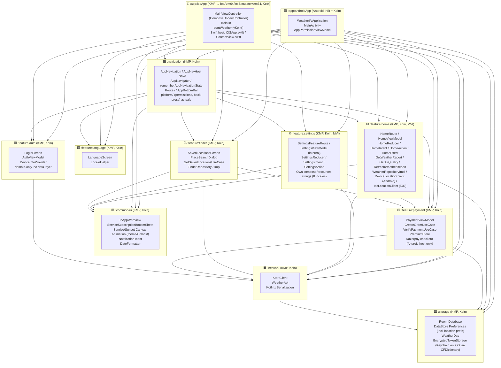
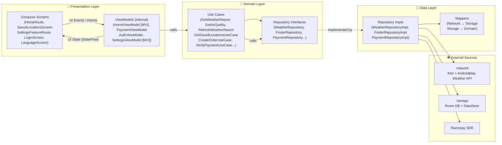
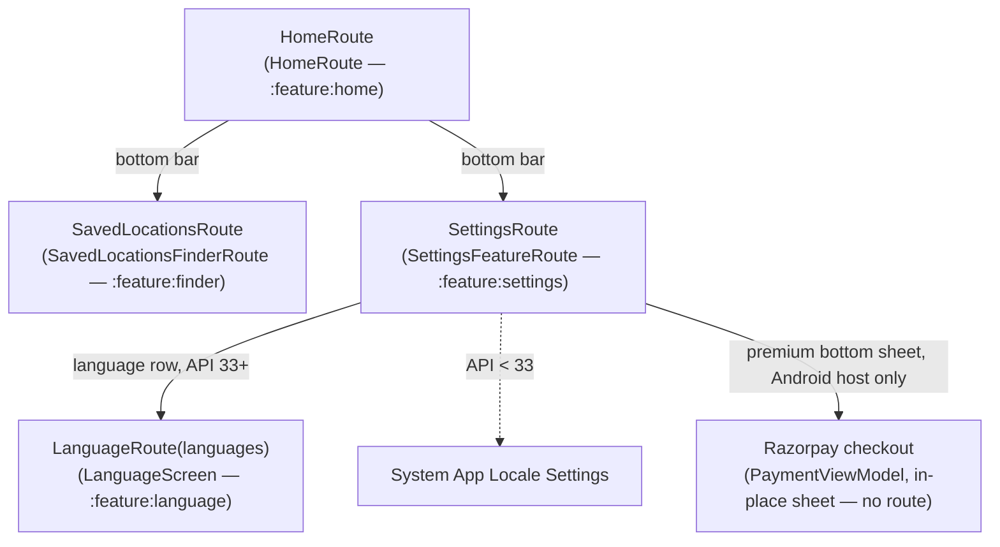

[](https://github.com/bosankus/Compose-Weatherify/actions/workflows/ci.yml)
[](https://github.com/bosankus/Compose-Weatherify/actions/workflows/check-dependency-updates.yml)
[](https://www.codacy.com/gh/bosankus/Compose-Weatherify/dashboard?utm_source=github.com&utm_medium=referral&utm_content=bosankus/Compose-Weatherify&utm_campaign=Badge_Grade)


-3DDC84?style=flat&logo=android&logoColor=white)


# Weatherify

A production-grade **Kotlin Multiplatform** weather app built with **Compose Multiplatform** and **Clean Architecture** (MVI in the home and settings features), shipping to both **Android** (`:app:androidApp`) and **iOS** (`:app:iosApp`, via a native SwiftUI host). It shows real-time weather, air quality data, saved locations, and sunrise/sunset animations — with multi-language support and an in-app premium upgrade flow.

[](https://github.com/bosankus/Compose-Weatherify/releases/latest)

---

## Features

| Category | Details |
|---|---|
| **Weather** | Current conditions, feels-like temp, humidity, wind speed (`:feature:home`) |
| **Air Quality** | Real-time AQI with pollutant details (`:feature:home`) |
| **Location** | GPS-based auto-detection with fallback, saved locations list, and place search (`:feature:finder`) |
| **Sunrise/Sunset** | Custom animated sunrise/sunset arc, colors centralized in `:common-ui`'s `theme/Color.kt` (`:common-ui` module) |
| **Multi-language** | English, Bengali (বাংলা), Hindi (हिन्दी), Kannada (ಕನ್ನಡ), Malayalam (മലയാളം), Tamil (தமிழ்), Telugu (తెలుగు), Hebrew (עברית) via Per-App Language API (`:feature:language` KMP module) |
| **Premium** | In-app purchase flow via Razorpay, surfaced as a bottom sheet inside Settings (Android only — see [Module Architecture](#module-architecture)) |
| **Notifications** | Firebase Cloud Messaging (FCM) push notifications (Android) |
| **In-App Updates** | Google Play in-app update prompts (`InAppUpdateManager`, Android only) |
| **Remote Config** | Server-driven feature flags gating the home experience (Firebase Remote Config, iOS + Android) |
| **Location** | Retrying, timeout-bounded GPS fetch (`DeviceLocationClient`/`IosLocationClient`, 2 retries, 8s timeout, staleness/accuracy checks) with a shared `expect`/`actual RequestLocationPermission` API |
| **iOS App** | Native SwiftUI host (`:app:iosApp`) embedding the shared Compose UI via `ComposeUIViewController`, sharing every feature/domain module with Android |
| **Theming** | Material 3 + dynamic color + dark/light mode |

---

## Module Architecture

The project is split into clearly bounded Gradle modules. Everything except `:app:androidApp` and `:app:iosApp` is a **Kotlin Multiplatform (KMP)** module (`org.jetbrains.kotlin.multiplatform` + `com.android.kotlin.multiplatform.library` plugins) with `commonMain`/`androidMain`/`iosMain` source sets — every shared module compiles for both `iosArm64` and `iosSimulatorArm64` (no `iosX64`; Compose Multiplatform dropped Intel-simulator artifacts at 1.11.0). `:app` used to be a single Android module; it's now two thin platform hosts sitting on top of the same KMP module graph:

- **`:app:androidApp`** — plain Android application module, the only place **Hilt** is used (for `AppPermissionViewModel`). `WeatherifyApplication` boots Koin via `initKoin()`, and `MainActivity` hosts the shared UI through `AppNavigation(...)`.
- **`:app:iosApp`** — a KMP module (Android/Hilt-free) that builds a static Kotlin/Native framework named `ComposeApp`, plus an Xcode project (`iosApp.xcodeproj`/`.xcworkspace`, CocoaPods `Podfile`, `project.yml` for XcodeGen). `Koin.kt`'s `startWeatherifyKoin()` (Swift sees it as `KoinKt.startWeatherifyKoin()` — Kotlin/Native's Obj-C exporter renames `init*` functions to avoid clashing with Obj-C's `init` convention) boots the same Koin module graph as Android, minus Hilt. `MainViewController.kt` is the Compose entry point (`ComposeUIViewController { ... }`), invoked from `iOSApp.swift`/`ContentView.swift` in the native `iosApp/` Swift package.

Both app hosts depend on the exact same set of KMP modules — `:common-ui`, `:navigation`, `:storage`, `:network`, and every `:feature:*` module — so nearly all app logic (including the entire `AppContent`/toast/auth/navigation composition) is shared, not duplicated; only the platform shell (Activity vs. `UIViewController`, Hilt vs. none, Razorpay checkout which is Android-only) differs. Every KMP module uses **Koin**; only `:app:androidApp` additionally uses Hilt, bridged in via Koin-Hilt adapter modules. Navigation itself lives in its own KMP module, `:navigation`, which sits directly below both app hosts and aggregates every feature module.



> **DI note:** `:app:androidApp` uses Hilt only for `AppPermissionViewModel`. Every KMP module (`:navigation`, `:feature:home`, `:feature:settings`, `:common-ui`, `:feature:*`, `:network`, `:storage`, `:app:iosApp`) uses Koin internally. On Android, `WeatherifyApplication.initKoin()` registers the module graph and `app/androidApp/.../di/NetworkModule.kt` / `di/StorageModule.kt` bridge Koin-registered network/storage dependencies into Hilt; `di/PaymentKoinModule.kt` is itself a **Koin** module (`appPaymentKoinModule`, despite the name) providing `PaymentConfig`. On iOS, `app/iosApp/.../Koin.kt`'s `startWeatherifyKoin()` registers the identical module list (minus the Hilt bridge) and substitutes a stub `PaymentConfig` with a blank `razorpayKey` since Razorpay is Android-only — `PaymentViewModel` already guards on a blank key.

---

## Clean Architecture

Each feature is structured across three layers, with dependency arrows pointing **inward** — the domain layer has zero Android or framework dependencies. `:feature:home`, `:feature:finder`, and `:feature:payment` follow this strictly with a full `domain/` + `data/` split (repository interfaces vs. impls, use cases, mappers). `:feature:home` and `:feature:settings` additionally follow an **MVI** pattern in their presentation layer (`Intent` → `Reducer` → `State`/`Effect`) rather than plain imperative state updates; in both, the `ViewModel`/`Reducer`/`Action`/`State` types are `internal` and only a single public `*FeatureRoute` composable is exposed. `:feature:auth` is lighter-weight: it only defines a `domain/DeviceInfoProvider` interface with a platform-specific implementation wired directly through Koin — there is no separate `data/` package for auth.



---

## Navigation (Navigation 3)

Navigation lives in its own KMP module, **`:navigation`** (package `bose.ankush.navigation`), not inside either app host. It runs on **Jetpack Navigation 3** (`androidx.navigation3`), not the older `NavHost`/`NavController` API. `AppNavigation.kt` builds an `entryProvider`, and `AppNavHost.kt` renders it through `NavDisplay` on Android (via an `expect`/`actual` — the Android `actual` in `AppNavHost.android.kt` uses `navigation3-ui` directly, since it has no iOS artifact yet; iOS gets a custom renderer in `AppNavHost.ios.kt` that now uses `key()` instead of `Crossfade` to avoid composing outgoing/incoming entries with identical keys simultaneously). Backstack state is driven by a custom `AppNavigator` class / `rememberAppNavigationState()` wrapper, both in `AppNavigator.kt` — `AppNavigator` was refactored to only decorate the *active* tab's backstack, fixing a "Key was used multiple times" crash from `SaveableStateHolder` across multiple bottom-bar tabs. Routes are `@Serializable` `NavKey` objects defined in `Routes.kt`. The bottom bar (`AppBottomBar.kt`, also in `:navigation`) drives three top-level tabs: Home, Saved Locations, and Settings. `:app:androidApp`'s `MainActivity` and `:app:iosApp`'s `MainViewController` each just call `bose.ankush.navigation.AppNavigation(...)` inside their Compose entry point.

`:navigation`'s `platform/` package holds `expect`/`actual` wrappers for permission requests and back-press handling (`PlatformPermissions`, `NotificationPermissionRequest`, `ExitAppOnBackPress`), each with Android and iOS actuals. Location permissions have their own shared API, `RequestLocationPermission` (`@Composable expect fun`, in `:feature:home`'s `platform/` package): the Android `actual` uses `rememberLauncherForActivityResult` with `ActivityResultContracts.RequestMultiplePermissions` and `shouldShowRequestPermissionRationale` to detect permanent denial; the iOS `actual` bridges `CLLocationManager` delegate callbacks into a coroutine via `CompletableDeferred`, and treats any denial as permanent (matching iOS's own permission model, where re-granting requires a trip to Settings).



Notes:
- There is no standalone `ProfileScreen` or `PaymentScreen` route — profile info and the premium upgrade flow are both embedded inside `SettingsFeatureRoute` (profile header + a premium bottom sheet), and `SettingsViewModel` is `internal` to `:feature:settings` (Koin-resolved), not exposed to either app host.
- `InAppWebView` (`:common-ui`) is a composable (not a route) shown conditionally inside `SettingsFeatureRoute` (and directly in `MainViewController` for the logged-out state on iOS) for Terms/Privacy links.
- On Android 13+ (`isDeviceSDKAndroid13OrAbove()`), language selection pushes `LanguageRoute`; below API 33 it deep-links to the system per-app language settings instead.
- The old quick city switcher (`CitiesListRoute`) has been fully removed from the codebase — superseded by `:feature:finder`'s saved-locations flow.
- `HomeFeatureRoute` was renamed to `HomeRoute`.

---

## Data Flow

```text
Androidplay Weather API (https://data.androidplay.in)
       │  JSON (Ktor + Kotlinx Serialization)
       ▼
  :network module  ──────►  Network Models
                                  │
                             NetworkToStorageMapper
                                  │
                                  ▼
                         :storage module (Room DB / DataStore)
                                  │
                             Storage → Domain mapper
                                  │
                                  ▼
                            Domain Models
                                  │
                       Use Cases (:feature:home domain layer)
                                  │
                                  ▼
                    HomeViewModel — HomeIntent → HomeReducer → HomeState
                                  │
                                  ▼
                  Jetpack Compose UI (screens, via Nav3 NavDisplay)
```

---

## Tech Stack

### UI

| Library | Version | Purpose |
|---|---|---|
| Jetpack Compose BOM | `2026.06.00` | Declarative UI framework |
| Compose Multiplatform | `1.12.0-beta01` | Shared Compose UI for KMP modules, incl. `:app:iosApp`'s `ComposeUIViewController` |
| Material 3 | `1.9.0` | Design system + dynamic theming |
| Navigation 3 (`androidx.navigation3`) | `1.1.4` | Type-safe backstack + `NavDisplay`/`entryProvider` |
| Lifecycle ViewModel Nav3 | `2.11.0` | ViewModel scoping for Nav3 entries |
| Coil Compose | `2.7.0` (Android) / Coil3 `3.4.0` (KMP modules) | Async image loading |
| Splash Screen API | `1.2.0` | Android 12+ splash screen |

### Architecture & DI

| Library | Version | Purpose |
|---|---|---|
| Hilt | `2.59.2` | Dependency injection — `:app:androidApp` only (`AppPermissionViewModel`) |
| Koin | `4.2.2` | DI in all KMP modules (`:navigation`, `:feature:home`, `:feature:settings`, `:common-ui`, `:feature:*`, `:network`, `:storage`, `:app:iosApp`) |
| Kotlin Coroutines | `1.11.0` | Async & structured concurrency |
| StateFlow / Flow | — | Reactive UI state management |

### Networking

| Library | Version | Purpose |
|---|---|---|
| Ktor Client | `3.5.1` | KMP-compatible HTTP client |
| Kotlinx Serialization | `1.11.0` | JSON parsing |
| OkHttp MockWebServer | `4.12.0` | Network mocking (declared; not yet exercised by tests — see Testing) |

### Local Storage

| Library | Version | Purpose |
|---|---|---|
| Room | `2.8.4` | SQLite ORM (weather cache) — requires 2.7+ to emit Kotlin under the KMP Android library plugin |
| DataStore Preferences | `1.2.1` | Key-value persistent settings, incl. location preferences |
| Kotlinx DateTime | `0.8.0` | KMP-compatible date/time |
| iOS Keychain (CoreFoundation) | — | `EncryptedTokenStorageImpl`'s iOS `actual` uses `CFDictionary` APIs directly for Keychain reads/writes (not `NSMutableDictionary`) |

### Firebase

| SDK | Purpose |
|---|---|
| Firebase BOM `34.15.0` (Android) / CocoaPods (iOS) | BoM / pod versions for consistent Firebase SDKs across platforms |
| Analytics | Declared dependency (Android); no explicit `logEvent` calls in code yet (auto-instrumentation only) |
| Remote Config | Server-driven feature flags (`HomeRemoteConfigGate`); `initializeFirebase()` runs on both Android (`WeatherifyApplication`) and iOS (`:feature:home`'s `di`, invoked from `Koin.kt`'s `startWeatherifyKoin()` and `iOSApp.swift`'s `FirebaseApp.configure()`) |
| Performance Monitoring | Network + rendering metrics (Android) |
| Cloud Messaging (FCM) | Push notifications (`WeatherifyMessagingService`, Android only) |

**iOS-specific tooling:** CocoaPods (`app/iosApp/Podfile`/`Podfile.lock`) pulls in `FirebaseCore`, `FirebaseRemoteConfig`, and their transitive dependencies (`FirebaseABTesting`, `FirebaseCoreInternal`, `FirebaseInstallations`, `GoogleUtilities`, `PromisesObjC`, `FirebaseSharedSwift`) for `:feature:home`. The Xcode project itself (`iosApp.xcodeproj`/`.xcworkspace`) is regenerated from `app/iosApp/project.yml` via **XcodeGen** — both are gitignored since they're build outputs, not source of truth.

### Testing

| Library | Purpose | Status |
|---|---|---|
| JUnit 4 + Truth | Unit assertions | Declared; **`app/androidApp/src/test` does not exist — zero unit tests** |
| Turbine `1.2.1` | Flow/StateFlow testing | Declared, not yet exercised |
| Mockk `1.14.11` | Kotlin-first mocking | Declared, not yet exercised |
| Espresso + Hilt Testing | Instrumentation UI tests | Removed from the version catalog (along with Mockito-Inline and `accompanist-permissions`) during the iOS module split; `app/androidApp/build.gradle.kts` still points `testInstrumentationRunner` at `bose.ankush.weatherify.helper.HiltTestRunner`, a class that doesn't exist in the repo |

> See [Testing Status](#testing-status) below — the test table above reflects declared dependencies, not actual coverage.

### Other

| Library | Purpose |
|---|---|
| Timber `5.0.1` | Structured logging |
| LeakCanary `2.14` | Memory leak detection (debug) |
| Razorpay `1.6.41` | In-app payment checkout |
| Google Play In-App Update | Forced/flexible update prompts (`InAppUpdateManager`) |
| Google Play Location `21.4.0` | FusedLocationProvider |

---

## Screens

```text
MainActivity (Android, Hilt entry point) / MainViewController (iOS, ComposeUIViewController)
└── AppNavigation (Nav3 NavDisplay + entryProvider — :navigation)
    ├── HomeRoute             — current weather + AQI card, MVI-driven               (:feature:home)
    ├── SavedLocationsFinderRoute — manage saved locations & search new places       (:feature:finder)
    ├── SettingsFeatureRoute — profile header, language row, notification toggle,    (:feature:settings)
    │                          premium bottom sheet (Android only), in-app Terms/Privacy web view; MVI-driven
    │   └── InAppWebView     — in-app browser composable, not a separate route       (:common-ui)
    ├── LanguageScreen       — per-app language picker (Android 13+ only)            (:feature:language)
    └── LoginScreen          — authentication entry point                           (:feature:auth)
```

> There is no standalone `ProfileScreen` or `PaymentScreen` — both live inside `SettingsFeatureRoute`. This screen tree is identical on Android and iOS; only the two app hosts differ (see [Module Architecture](#module-architecture)).

---

## Testing Status

Test infrastructure (MockWebServer, Turbine, Mockk) is declared in the build files, but **there is currently no test coverage at all**:

- No `app/androidApp/src/test` directory exists — the unit tests it previously held have been removed
- No `androidTest`/`androidInstrumentedTest` directory with content exists in any module
- No `commonTest`/`iosTest` source sets with test files exist in `:storage` or `:network`
- `app/androidApp/build.gradle.kts` references a `HiltTestRunner` class as `testInstrumentationRunner` that doesn't exist anywhere in the repo — a dangling config left over from the removed tests
- `:app:iosApp` has no XCTest target yet

This is a known gap, not a design choice — treat the Testing table above as the target stack, not current coverage.

---

## Setup & Installation

### Android

**Prerequisites**
- Android Studio Narwhal or later
- JDK 17 (JDK 21 is used by CI)

**Steps**

1. **Clone the repo**
   ```bash
   git clone https://github.com/bosankus/Compose-Weatherify.git
   cd Compose-Weatherify
   ```

2. **Add `google-services.json`** to `app/androidApp/` (from Firebase console — required for Analytics/FCM to compile).

3. **Build & run**
   ```bash
   ./gradlew :app:androidApp:assembleDebug
   # or just hit Run in Android Studio, module ":app:androidApp"
   ```

> **Minimum Android version:** API 28 (Android 9 Pie)
> **Compile / Target SDK:** 37

### iOS

**Prerequisites**
- macOS with Xcode (latest stable)
- [XcodeGen](https://github.com/yonaskolb/XcodeGen) (`brew install xcodegen`) — generates the `.xcodeproj`/`.xcworkspace` from `app/iosApp/project.yml`; both are gitignored build outputs
- [CocoaPods](https://cocoapods.org/) (`sudo gem install cocoapods`) — resolves the Firebase pods declared in `app/iosApp/Podfile`

**Steps**

1. **Add `GoogleService-Info.plist`** to `app/iosApp/iosApp/` (from Firebase console — required for Remote Config to compile/run).

2. **Generate the Xcode project and install pods**
   ```bash
   cd app/iosApp
   xcodegen generate
   pod install
   ```

3. **Open and run**
   ```bash
   open iosApp.xcworkspace
   # Build & run the "iosApp" scheme on a Simulator or a physical arm64 device
   ```
   The `iosApp` target's pre-build "Run Script" phase invokes `./gradlew :app:iosApp:embedAndSignAppleFrameworkForXcode` automatically on every build, compiling the shared Kotlin code into the `ComposeApp.framework` Xcode links against — no separate Gradle step needed.

> `:app:iosApp` builds `iosArm64` and `iosSimulatorArm64` only — Intel simulators (`iosX64`) are unsupported, matching every other KMP module in the repo since Compose Multiplatform dropped that target at `1.11.0`.

---

## Code Quality

All style/lint versions and rules come from `gradle/libs.versions.toml` and `config/detekt.yml`, applied consistently across every subproject from the root `build.gradle.kts`.

| Task | What it does |
|---|---|
| `spotlessCheckAll` | Checks Kotlin/ktlint formatting across all modules (no changes made) |
| `detektAll` | Runs static analysis across all modules (no changes made) |
| `codeCheck` | `spotlessCheckAll` + `detektAll` — the full audit, matches CI's `lint` job |
| `spotlessApplyAll` | Auto-formats Kotlin/ktlint across all modules |
| `detektAllAutoCorrect` | Auto-corrects the subset of detekt rules that support it |
| `codeFormat` | `spotlessApplyAll` + `detektAllAutoCorrect` — the full auto-fix, matches CI's formatting step |

Before opening a PR, run everything in one shot:

```bash
./gradlew spotlessApplyAll detektAllAutoCorrect codeFormat
```

`codeFormat` already depends on `spotlessApplyAll` and `detektAllAutoCorrect`, so this single command applies formatting once and detekt auto-corrections once (Gradle de-duplicates the shared tasks) — then verify cleanly with `./gradlew codeCheck`.

---

## CI/CD

`.github/workflows/ci.yml` runs on every PR, on Ubuntu (Android-only — there is no macOS/iOS job yet):

- **`build`** — JDK 21, Android SDK 36, `./gradlew build`, uploads the debug APK and publishes JUnit XML test results
- **`lint`** — runs `codeFormat` (auto-commits formatting fixes), then `codeCheck` (Spotless + Detekt)

> Both jobs decode `google-services.json` to `app/google-services.json`, but the Google Services plugin now applies to `:app:androidApp`, which reads from `app/androidApp/google-services.json` — a leftover from the `:app` → `:app:androidApp`/`:app:iosApp` split that's worth double-checking if CI's `build` job starts failing on the Google Services task.

`.github/workflows/check-dependency-updates.yml` runs weekly, executes the `dependencyUpdates` (ben-manes) task, and opens a GitHub issue if outdated dependencies are found.

---

## Contributing

Contributions are very welcome!

1. Fork the repository
2. Create a feature branch: `git checkout -b feature/your-feature`
3. Run `./gradlew spotlessApplyAll detektAllAutoCorrect codeFormat` before committing (see [Code Quality](#code-quality))
4. Commit using the project convention:
   ```text
   feat|fix|refactor|migrate|update: short description
   ```
5. Push and open a Pull Request against **`develop`**

CI builds the project and runs Spotless/Detekt checks on every PR (see [CI/CD](#cicd)).

---

## What's Next

These are the planned improvements currently in progress or on the roadmap:

- **iOS parity polish** — the app now builds and runs on iOS (`:app:iosApp`, SwiftUI host + shared Compose UI), but premium purchase (Razorpay is Android-only), push notifications (FCM), in-app updates, and Analytics/Performance Monitoring have no iOS equivalent yet. There's also no macOS/iOS CI job — `.github/workflows/ci.yml` only builds/lints Android.
- **Real test coverage** — the codebase currently has zero tests (see [Testing Status](#testing-status)): add `androidTest` instrumentation tests, exercise the already-declared Mockk/Turbine/MockWebServer dependencies, populate `commonTest`/`iosTest` source sets in `:storage`/`:network`, add an XCTest target for `:app:iosApp`, and fix or remove the dangling `HiltTestRunner` reference in `app/androidApp/build.gradle.kts`.
- **Offline-first strategy** — full read-from-cache-then-network flow using Room as the single source of truth, with explicit stale-data indicators in the UI.
- **Widget support** — a Glance-based home screen widget (Android) / WidgetKit extension (iOS) showing current temperature and conditions.
- **Wear OS companion** — lightweight Wear Compose screen for wrist-based weather glances.
- **Release automation** — CI already builds and lints every PR; the next step is automated release builds, Play Store internal track deployments, and a TestFlight pipeline for iOS.
- **Accessibility pass** — semantic descriptions, touch target sizing, and TalkBack/VoiceOver compatibility audit on both platforms.

---

## License

This project intends to use the MIT License; a `LICENSE` file has not yet been added to the repository.
