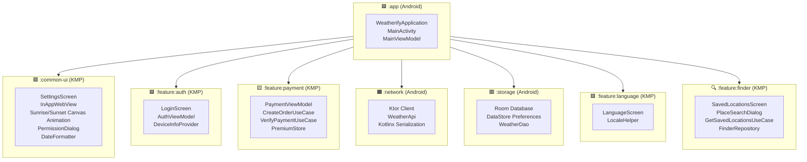
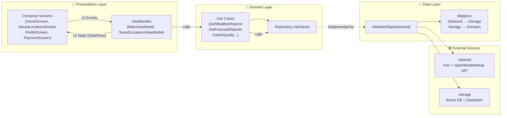

[](https://github.com/bosankus/Compose-Weatherify/actions/workflows/ci.yml)
[](https://github.com/bosankus/Compose-Weatherify/actions/workflows/check-dependency-updates.yml)
[](https://www.codacy.com/gh/bosankus/Compose-Weatherify/dashboard?utm_source=github.com&utm_medium=referral&utm_content=bosankus/Compose-Weatherify&utm_campaign=Badge_Grade)

-3DDC84?style=flat&logo=android&logoColor=white)


# Weatherify

A production-grade Android weather app built with **Jetpack Compose**, **Clean Architecture**, and a **Kotlin Multiplatform-ready** module structure. It shows real-time weather, 5-day forecasts, air quality data, and sunrise/sunset animations — with multi-language support and an in-app premium upgrade flow.

[](https://github.com/bosankus/Compose-Weatherify/releases/latest)

---

## Features

| Category | Details |
|---|---|
| **Weather** | Current conditions, feels-like temp, humidity, wind speed |
| **Forecast** | 5-day weather forecast with hourly breakdown |
| **Air Quality** | Real-time AQI with pollutant details |
| **Location** | GPS-based auto-detection + manual city search |
| **Sunrise/Sunset** | Custom animated sunrise/sunset arc (`:common-ui` module) |
| **Multi-language** | English, Bengali (বাংলা), Hindi (हिन्दी), Kannada (ಕನ್ನಡ), Malayalam (മലയാളം), Tamil (தமிழ்), Telugu (తెలుగు), Hebrew (עברית) via Per-App Language API (`:feature:language` KMP module) |
| **Premium** | In-app purchase flow via Razorpay with a premium bottom sheet |
| **Notifications** | Firebase Cloud Messaging (FCM) push notifications |
| **In-App Updates** | Google Play in-app update prompts |
| **Theming** | Material 3 + dynamic color + dark/light mode |

---

## Module Architecture

The project is split into clearly bounded Gradle modules. `common-ui`, `feature:auth`, `feature:finder`, `feature:payment`, and `feature:language` are **Kotlin Multiplatform (KMP)** modules with `commonMain` source sets — making the app iOS-portable without a full rewrite.



---

## Clean Architecture

Each feature is structured across three layers. Dependency arrows always point **inward** — the domain layer has zero Android or framework dependencies. Features like `:feature:finder` and `:feature:payment` strictly follow Clean Architecture with abstracted UseCase interfaces and separate data-layer implementations.



---

## Data Flow

```text
OpenWeatherMap API
       │  JSON (Ktor + Kotlinx Serialization)
       ▼
  :network module  ──────►  Network Models
                                  │
                             NetworkToStorageMapper
                                  │
                                  ▼
                         :storage module (Room DB / DataStore)
                                  │
                             Storage → Domain mapper
                                  │
                                  ▼
                            Domain Models
                                  │
                           Use Cases (domain layer)
                                  │
                                  ▼
                          MainViewModel / CitiesViewModel
                          (StateFlow<UIState>)
                                  │
                                  ▼
                        Jetpack Compose UI (screens)
```

---

## Tech Stack

### UI

| Library | Version | Purpose |
|---|---|---|
| Jetpack Compose BOM | `2026.06.00` | Declarative UI framework |
| Compose Multiplatform | `1.11.1` | Shared Compose UI for KMP modules |
| Material 3 | BOM-managed | Design system + dynamic theming |
| Compose Navigation | `2.7.7` | Type-safe screen navigation |
| Accompanist Permissions | `0.36.0` | Runtime permissions in Compose |
| Coil Compose | `2.7.0` | Async image loading |
| Splash Screen API | `1.2.0` | Android 12+ splash screen |

### Architecture & DI

| Library | Version | Purpose |
|---|---|---|
| Hilt | `2.59.2` | Dependency injection (Android) |
| Koin | `4.2.2` | DI in KMP feature modules |
| Kotlin Coroutines | `1.11.0` | Async & structured concurrency |
| StateFlow / Flow | — | Reactive UI state management |

### Networking

| Library | Version | Purpose |
|---|---|---|
| Ktor Client | `3.5.1` | KMP-compatible HTTP client |
| Kotlinx Serialization | `1.11.0` | JSON parsing |
| OkHttp MockWebServer | `4.12.0` | Network mocking in tests |

### Local Storage

| Library | Version | Purpose |
|---|---|---|
| Room | `2.8.4` | SQLite ORM (weather cache) |
| DataStore Preferences | `1.2.1` | Key-value persistent settings |
| Kotlinx DateTime | `0.8.0` | KMP-compatible date/time |

### Firebase

| SDK | Purpose |
|---|---|
| Firebase BOM `34.15.0` | BoM for consistent versions |
| Analytics | User behaviour tracking |
| Remote Config | Server-driven feature flags |
| Performance Monitoring | Network + rendering metrics |
| Cloud Messaging (FCM) | Push notifications |

### Testing

| Library | Purpose |
|---|---|
| JUnit 4 + Truth | Unit assertions |
| Turbine `1.2.1` | Flow/StateFlow testing |
| Mockk `1.14.11` | Kotlin-first mocking |
| Mockito + Nhaarman | Java-style mocking |
| Espresso `3.7.0` | Instrumentation UI tests |
| Hilt Testing | DI in Android tests |

### Other

| Library | Purpose |
|---|---|
| Timber `5.0.1` | Structured logging |
| LeakCanary `2.13` | Memory leak detection (debug) |
| Razorpay `1.6.41` | In-app payment checkout |
| Google Play In-App Update | Forced/flexible update prompts |
| Google Play Location `21.3.0` | FusedLocationProvider |

---

## Screens

```text
MainActivity
├── HomeScreen          — current weather + AQI card + hourly strip
├── SavedLocationsScreen — manage saved cities & search for new places (via `:feature:finder`)
├── ProfileScreen       — user profile & settings shortcut
├── SettingsScreen      — language, theme, notification toggles
├── LoginScreen         — authentication entry point
├── PaymentScreen       — Razorpay premium upgrade flow
└── InAppWebView        — in-app browser for T&C / privacy policy
```

---

## Setup & Installation

### Prerequisites
- Android Studio Narwhal or later
- JDK 17
- An [OpenWeatherMap](https://openweathermap.org/api) API key (free tier works)

### Steps

1. **Clone the repo**
   ```bash
   git clone https://github.com/bosankus/Compose-Weatherify.git
   cd Compose-Weatherify
   ```

2. **Add your API key** to `local.properties` (create the file if it doesn't exist):
   ```properties
   OPEN_WEATHER_API_KEY=your_api_key_here
   ```

3. **Add `google-services.json`** to `app/` (from Firebase console — required for Analytics/FCM to compile).

4. **Build & run**
   ```bash
   ./gradlew assembleDebug
   # or just hit Run in Android Studio
   ```

> **Minimum Android version:** API 28 (Android 9 Pie)  
> **Target SDK:** 37

---

## Contributing

Contributions are very welcome!

1. Fork the repository
2. Create a feature branch: `git checkout -b feature/your-feature`
3. Commit using the project convention:
   ```text
   feat|fix|refactor|migrate|update: short description
   ```
4. Push and open a Pull Request against **`develop`**

CI (`.github/workflows/ci.yml`) builds the project and runs spotless/detekt checks on every PR.

---

## What's Next

These are the planned improvements currently in progress or on the roadmap:

- **iOS target** — the KMP foundation is in place (`:common-ui`, `:feature:auth`, `:feature:finder`, `:feature:payment`, `:feature:language` all build `commonMain`). The next step is wiring up a SwiftUI host app and completing the remaining iOS-specific implementations.
- **Offline-first strategy** — full read-from-cache-then-network flow using Room as the single source of truth, with explicit stale-data indicators in the UI.
- **Widget support** — a Glance-based home screen widget showing current temperature and conditions.
- **Wear OS companion** — lightweight Wear Compose screen for wrist-based weather glances.
- **Release automation** — CI already builds and lints every PR (`ci.yml`); the next step is automated release builds and Play Store internal track deployments.
- **Accessibility pass** — semantic descriptions, touch target sizing, and TalkBack compatibility audit.

---

## License

This project intends to use the MIT License; a `LICENSE` file has not yet been added to the repository.
