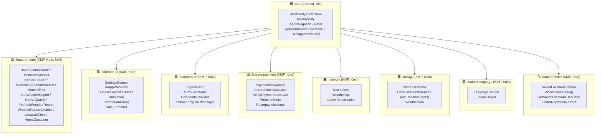
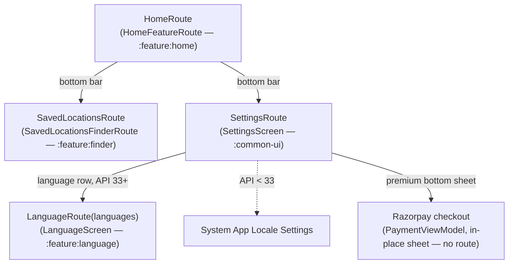

[](https://github.com/bosankus/Compose-Weatherify/actions/workflows/ci.yml)
[](https://github.com/bosankus/Compose-Weatherify/actions/workflows/check-dependency-updates.yml)
[](https://www.codacy.com/gh/bosankus/Compose-Weatherify/dashboard?utm_source=github.com&utm_medium=referral&utm_content=bosankus/Compose-Weatherify&utm_campaign=Badge_Grade)


-3DDC84?style=flat&logo=android&logoColor=white)


# Weatherify

A production-grade Android weather app built with **Jetpack Compose**, **Clean Architecture** (MVI in the home feature), and a **Kotlin Multiplatform** module structure. It shows real-time weather, air quality data, saved locations, and sunrise/sunset animations — with multi-language support and an in-app premium upgrade flow.

[](https://github.com/bosankus/Compose-Weatherify/releases/latest)

---

## Features

| Category | Details |
|---|---|
| **Weather** | Current conditions, feels-like temp, humidity, wind speed (`:feature:home`) |
| **Air Quality** | Real-time AQI with pollutant details (`:feature:home`) |
| **Location** | GPS-based auto-detection with fallback, saved locations list, and place search (`:feature:finder`) |
| **Sunrise/Sunset** | Custom animated sunrise/sunset arc (`:common-ui` module) |
| **Multi-language** | English, Bengali (বাংলা), Hindi (हिन्दी), Kannada (ಕನ್ನಡ), Malayalam (മലയാളം), Tamil (தமிழ்), Telugu (తెలుగు), Hebrew (עברית) via Per-App Language API (`:feature:language` KMP module) |
| **Premium** | In-app purchase flow via Razorpay, surfaced as a bottom sheet inside Settings |
| **Notifications** | Firebase Cloud Messaging (FCM) push notifications |
| **In-App Updates** | Google Play in-app update prompts (`InAppUpdateManager`) |
| **Remote Config** | Server-driven feature flags gating the home experience (Firebase Remote Config, iOS + Android) |
| **Theming** | Material 3 + dynamic color + dark/light mode |

---

## Module Architecture

The project is split into clearly bounded Gradle modules. Everything except `:app` is a **Kotlin Multiplatform (KMP)** module (`org.jetbrains.kotlin.multiplatform` + `com.android.kotlin.multiplatform.library` plugins) with `commonMain`/`androidMain`/`iosMain` source sets — making the app iOS-portable without a full rewrite. `:app` stays a plain Android application module and is the only place Hilt is used; every KMP module uses **Koin**, bridged into `:app`'s Hilt graph via a Koin-Hilt adapter module.



> **DI note:** `:app` uses Hilt for its own ViewModels (`SettingsViewModel`, `AppPermissionViewModel`). Every KMP module (`:feature:home`, `:common-ui`, `:feature:*`, `:network`, `:storage`) uses Koin internally. `app/.../di/PaymentKoinModule.kt` bridges the two graphs so Hilt-managed code can resolve Koin-provided dependencies (e.g. `PaymentViewModel`).

---

## Clean Architecture

Each feature is structured across three layers, with dependency arrows pointing **inward** — the domain layer has zero Android or framework dependencies. `:feature:home`, `:feature:finder`, and `:feature:payment` follow this strictly with a full `domain/` + `data/` split (repository interfaces vs. impls, use cases, mappers). `:feature:home`'s presentation layer additionally follows an **MVI** pattern (`HomeIntent` → `HomeReducer` → `HomeState`/`HomeEffect`) rather than plain imperative state updates. `:feature:auth` is lighter-weight: it only defines a `domain/DeviceInfoProvider` interface with a platform-specific implementation wired directly through Koin — there is no separate `data/` package for auth.


---

## Navigation (Navigation 3)

The app runs on **Jetpack Navigation 3** (`androidx.navigation3`), not the older `NavHost`/`NavController` API. `AppNavigation.kt` builds an `entryProvider` and renders it through `NavDisplay`, driven by a custom `AppNavigator` / `rememberAppNavigationState()` wrapper around the Nav3 backstack. Routes are `@Serializable` `NavKey` objects defined in `Routes.kt`. The bottom bar (`AppBottomBar.kt`) drives three top-level tabs: Home, Saved Locations, and Settings.



Notes:
- There is no standalone `ProfileScreen` or `PaymentScreen` route — profile info and the premium upgrade flow are both embedded inside `SettingsScreen` (profile header + a `PremiumBottomSheet`).
- `InAppWebView` is a composable (not a route) shown conditionally inside `SettingsScreen` for Terms/Privacy links.
- On Android 13+ (`isDeviceSDKAndroid13OrAbove()`), language selection pushes `LanguageRoute`; below API 33 it deep-links to the system per-app language settings instead.
- `Routes.kt` still declares a `CitiesListRoute`, but it is not wired into the `entryProvider` — the quick city switcher was superseded by `:feature:finder`'s saved-locations flow.

---

## Data Flow

```text
OpenWeatherMap API
       │  JSON (Ktor + Kotlinx Serialization)
       ▼
  :network module  ──────►  Network Models
                                  │
                             NetworkToStorageMapper
                                  │
                                  ▼
                         :storage module (Room DB / DataStore)
                                  │
                             Storage → Domain mapper
                                  │
                                  ▼
                            Domain Models
                                  │
                       Use Cases (:feature:home domain layer)
                                  │
                                  ▼
                    HomeViewModel — HomeIntent → HomeReducer → HomeState
                                  │
                                  ▼
                  Jetpack Compose UI (screens, via Nav3 NavDisplay)
```

---

## Tech Stack

### UI

| Library | Version | Purpose |
|---|---|---|
| Jetpack Compose BOM | `2026.06.00` | Declarative UI framework |
| Compose Multiplatform | `1.11.1` | Shared Compose UI for KMP modules |
| Material 3 | `1.9.0` | Design system + dynamic theming |
| Navigation 3 (`androidx.navigation3`) | `1.1.4` | Type-safe backstack + `NavDisplay`/`entryProvider` |
| Lifecycle ViewModel Nav3 | `2.11.0` | ViewModel scoping for Nav3 entries |
| Coil Compose | `2.7.0` (Android) / Coil3 `3.4.0` (KMP modules) | Async image loading |
| Splash Screen API | `1.2.0` | Android 12+ splash screen |

### Architecture & DI

| Library | Version | Purpose |
|---|---|---|
| Hilt | `2.59.2` | Dependency injection — `:app` module only |
| Koin | `4.2.2` | DI in all KMP modules (`:feature:home`, `:common-ui`, `:feature:*`, `:network`, `:storage`) |
| Kotlin Coroutines | `1.11.0` | Async & structured concurrency |
| StateFlow / Flow | — | Reactive UI state management |

### Networking

| Library | Version | Purpose |
|---|---|---|
| Ktor Client | `3.5.1` | KMP-compatible HTTP client |
| Kotlinx Serialization | `1.11.0` | JSON parsing |
| OkHttp MockWebServer | `4.12.0` | Network mocking (declared; not yet exercised by tests — see Testing) |

### Local Storage

| Library | Version | Purpose |
|---|---|---|
| Room | `2.8.4` | SQLite ORM (weather cache) — requires 2.7+ to emit Kotlin under the KMP Android library plugin |
| DataStore Preferences | `1.2.1` | Key-value persistent settings, incl. location preferences |
| Kotlinx DateTime | `0.8.0` | KMP-compatible date/time |

### Firebase

| SDK | Purpose |
|---|---|
| Firebase BOM `34.15.0` | BoM for consistent versions |
| Analytics | Declared dependency; no explicit `logEvent` calls in code yet (auto-instrumentation only) |
| Remote Config | Server-driven feature flags (`HomeRemoteConfigGate`, Android + iOS implementations) |
| Performance Monitoring | Network + rendering metrics |
| Cloud Messaging (FCM) | Push notifications (`WeatherifyMessagingService`) |

### Testing

| Library | Purpose | Status |
|---|---|---|
| JUnit 4 + Truth | Unit assertions | 2 real test files in `app/src/test` |
| Turbine `1.2.1` | Flow/StateFlow testing | Declared, not yet exercised |
| Mockk `1.14.11` | Kotlin-first mocking | Declared, not yet exercised |
| Mockito + Nhaarman | Java-style mocking | Declared, not yet exercised |
| Espresso `3.7.0` + Hilt Testing | Instrumentation UI tests | Declared; **no `androidTest` sources exist yet** |

> See [Testing Status](#testing-status) below — the test table above reflects declared dependencies, not actual coverage.

### Other

| Library | Purpose |
|---|---|
| Timber `5.0.1` | Structured logging |
| LeakCanary `2.14` | Memory leak detection (debug) |
| Razorpay `1.6.41` | In-app payment checkout |
| Google Play In-App Update | Forced/flexible update prompts (`InAppUpdateManager`) |
| Google Play Location `21.3.0` | FusedLocationProvider |

---

## Screens

```text
MainActivity (Hilt entry point)
└── AppNavigation (Nav3 NavDisplay + entryProvider)
    ├── HomeFeatureRoute     — current weather + AQI card, MVI-driven               (:feature:home)
    ├── SavedLocationsFinderRoute — manage saved locations & search new places      (:feature:finder)
    ├── SettingsScreen       — profile header, language row, notification toggle,   (:common-ui)
    │                          premium bottom sheet, and in-app Terms/Privacy web view
    │   └── InAppWebView     — in-app browser composable, not a separate route      (:common-ui)
    ├── LanguageScreen       — per-app language picker (Android 13+ only)           (:feature:language)
    └── LoginScreen          — authentication entry point                          (:feature:auth)
```

> There is no standalone `ProfileScreen` or `PaymentScreen` — both live inside `SettingsScreen`.

---

## Testing Status

Test infrastructure (Espresso, Hilt Testing, MockWebServer, `commonTest`/`iosTest` source sets in `:storage`/`:network`) is declared in the build files, but real coverage today is minimal:

- `app/src/test/` — 2 unit tests (`common/ExtensionTest.kt`, `base/DateTimeUtilsTest.kt`)
- No `androidTest` directory exists in any module
- `:storage` and `:network` declare `commonTest`/`iosTest` source sets with no test files in them

This is a known gap, not a design choice — treat the Testing table above as the target stack, not current coverage.

---

## Setup & Installation

### Prerequisites
- Android Studio Narwhal or later
- JDK 17 (JDK 21 is used by CI)
- An [OpenWeatherMap](https://openweathermap.org/api) API key (free tier works)

### Steps

1. **Clone the repo**
   ```bash
   git clone https://github.com/bosankus/Compose-Weatherify.git
   cd Compose-Weatherify
   ```

2. **Add your API key** to `local.properties` (create the file if it doesn't exist):
   ```properties
   OPEN_WEATHER_API_KEY=your_api_key_here
   ```

3. **Add `google-services.json`** to `app/` (from Firebase console — required for Analytics/FCM to compile).

4. **Build & run**
   ```bash
   ./gradlew assembleDebug
   # or just hit Run in Android Studio
   ```

> **Minimum Android version:** API 28 (Android 9 Pie)
> **Compile / Target SDK:** 37

---

## Code Quality

All style/lint versions and rules come from `gradle/libs.versions.toml` and `config/detekt.yml`, applied consistently across every subproject from the root `build.gradle.kts`.

| Task | What it does |
|---|---|
| `spotlessCheckAll` | Checks Kotlin/ktlint formatting across all modules (no changes made) |
| `detektAll` | Runs static analysis across all modules (no changes made) |
| `codeCheck` | `spotlessCheckAll` + `detektAll` — the full audit, matches CI's `lint` job |
| `spotlessApplyAll` | Auto-formats Kotlin/ktlint across all modules |
| `detektAllAutoCorrect` | Auto-corrects the subset of detekt rules that support it |
| `codeFormat` | `spotlessApplyAll` + `detektAllAutoCorrect` — the full auto-fix, matches CI's formatting step |

Before opening a PR, run everything in one shot:

```bash
./gradlew spotlessApplyAll detektAllAutoCorrect codeFormat
```

`codeFormat` already depends on `spotlessApplyAll` and `detektAllAutoCorrect`, so this single command applies formatting once and detekt auto-corrections once (Gradle de-duplicates the shared tasks) — then verify cleanly with `./gradlew codeCheck`.

---

## CI/CD

`.github/workflows/ci.yml` runs on every PR:

- **`build`** — JDK 21, Android SDK 36, `./gradlew build`, uploads the debug APK and publishes JUnit XML test results
- **`lint`** — runs `codeFormat` (auto-commits formatting fixes), then `codeCheck` (Spotless + Detekt)

`.github/workflows/check-dependency-updates.yml` runs weekly, executes the `dependencyUpdates` (ben-manes) task, and opens a GitHub issue if outdated dependencies are found.

---

## Contributing

Contributions are very welcome!

1. Fork the repository
2. Create a feature branch: `git checkout -b feature/your-feature`
3. Run `./gradlew spotlessApplyAll detektAllAutoCorrect codeFormat` before committing (see [Code Quality](#code-quality))
4. Commit using the project convention:
   ```text
   feat|fix|refactor|migrate|update: short description
   ```
5. Push and open a Pull Request against **`develop`**

CI builds the project and runs Spotless/Detekt checks on every PR (see [CI/CD](#cicd)).

---

## What's Next

These are the planned improvements currently in progress or on the roadmap:

- **iOS target** — the KMP foundation is in place across all non-`:app` modules (`commonMain`/`androidMain`/`iosMain`, with `:feature:home`/`:network`/`:storage` also building `iosX64`). The next step is wiring up a SwiftUI host app and completing the remaining iOS-specific implementations.
- **Real test coverage** — close the gap described in [Testing Status](#testing-status): add `androidTest` instrumentation tests, exercise the already-declared Mockk/Turbine/MockWebServer dependencies, and populate the empty `commonTest`/`iosTest` source sets in `:storage`/`:network`.
- **Offline-first strategy** — full read-from-cache-then-network flow using Room as the single source of truth, with explicit stale-data indicators in the UI.
- **Widget support** — a Glance-based home screen widget showing current temperature and conditions.
- **Wear OS companion** — lightweight Wear Compose screen for wrist-based weather glances.
- **Release automation** — CI already builds and lints every PR; the next step is automated release builds and Play Store internal track deployments.
- **Accessibility pass** — semantic descriptions, touch target sizing, and TalkBack compatibility audit.
- **Dead code cleanup** — `CitiesListRoute` in `Routes.kt` is no longer wired into navigation and can likely be removed.

---

## License

This project intends to use the MIT License; a `LICENSE` file has not yet been added to the repository.
