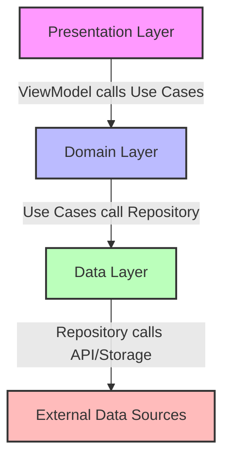
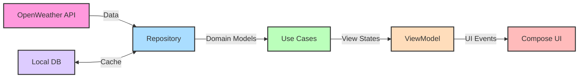

[](https://github.com/bosankus/Compose-Weatherify/actions/workflows/check-dependecy-updates.yml)
[](https://www.codacy.com/gh/bosankus/Compose-Weatherify/dashboard?utm_source=github.com&amp;utm_medium=referral&amp;utm_content=bosankus/Compose-Weatherify&amp;utm_campaign=Badge_Grade)
[](https://github.com/bosankus/Compose-Weatherify/actions/workflows/code_quality.yml)

# Weatherify

A modern weather application built with Jetpack Compose that provides current weather conditions, forecasts, and air quality information.

[]( )

## 📱 Features

- **Current Weather**: View today's temperature and weather conditions
- **5-Day Forecast**: See weather predictions for the next 4 days
- **Air Quality Index**: Monitor air pollution levels
- **Multiple Cities**: Search and save your favorite locations
- **Multi-language Support**: Available in English, Hindi, and Hebrew
- **Material 3 Design**: Modern UI with dynamic theming
- **Location-based Weather**: Automatic weather updates based on your current location

## 🏗️ Architecture

The app follows Clean Architecture principles with MVVM pattern:



### Data Flow



## 🚀 Recent Updates

### 🧩 Language Support
- App language change implemented using [Per App Language Preference](https://developer.android.com/guide/topics/resources/app-languages#androidx-impl)
- Material 3 migration
- Added dynamic theme

### 📱 Demo
[POC-1.webm](https://github.com/bosankus/Compose-Weatherify/assets/46471379/455f1c9d-f1e5-482d-9c29-a1c23b4e3679)

## 🛠️ Tech Stack

- **UI Framework**:
  - Jetpack Compose with Material 3
  - Compose Navigation
  - Compose Permissions
  - Lottie Compose for animations
  - Coil Compose for image loading
  - Custom Sunrise/Sunset animation UI

- **Architecture**:
  - MVVM (Model-View-ViewModel)
  - Clean Architecture (Presentation, Domain, Data layers)
  - Multi-module project structure
  - Kotlin Multiplatform Mobile (KMM) for shared code

- **Concurrency & Reactive Programming**:
  - Kotlin Coroutines
  - Flow
  - StateFlow for UI state management

- **Dependency Injection**:
  - Hilt for Android
  - Koin for KMM modules

- **Networking**:
  - Ktor client
  - Kotlinx Serialization
  - Content negotiation

- **Local Storage**:
  - Room Database
  - DataStore Preferences
  - Kotlinx DateTime

- **Testing**:
  - JUnit for unit tests
  - Turbine for Flow testing
  - Mockk and Mockito for mocking
  - Espresso for UI testing

- **Firebase**:
  - Analytics
  - Remote Config
  - Performance Monitoring

- **Other Tools & Libraries**:
  - Timber for logging
  - LeakCanary for memory leak detection
  - In-app updates
  - Splash Screen API
  - Dynamic theming
  - Multi-language support

## 🔧 Setup & Installation

1. Clone the repository
   ```bash
   git clone https://github.com/bosankus/Compose-Weatherify.git
   ```

2. Open the project in Android Studio

3. Get an API key from [OpenWeatherMap](https://openweathermap.org/api)

4. Add your API key to `local.properties`:
   ```
   OPEN_WEATHER_API_KEY=your_api_key_here
   ```

5. Build and run the app

## 🤝 Contributing

Contributions are welcome! Please feel free to submit a Pull Request.

1. Fork the repository
2. Create your feature branch (`git checkout -b feature/amazing-feature`)
3. Commit your changes (`git commit -m 'feat/bug/refactor/migrate/update:Add some amazing feature'`)
4. Push to the branch (`git push origin feature/amazing-feature`)
5. Open a Pull Request
